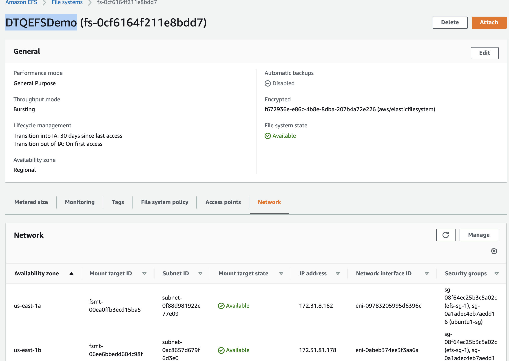
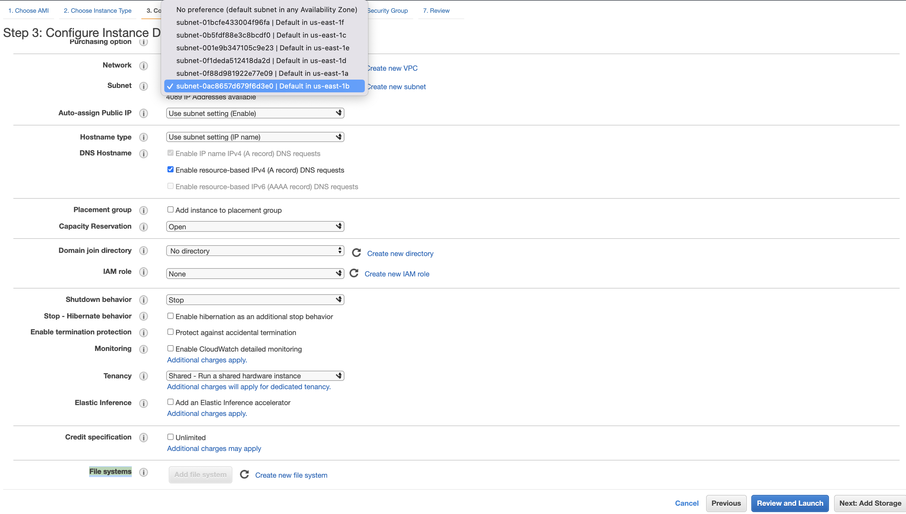
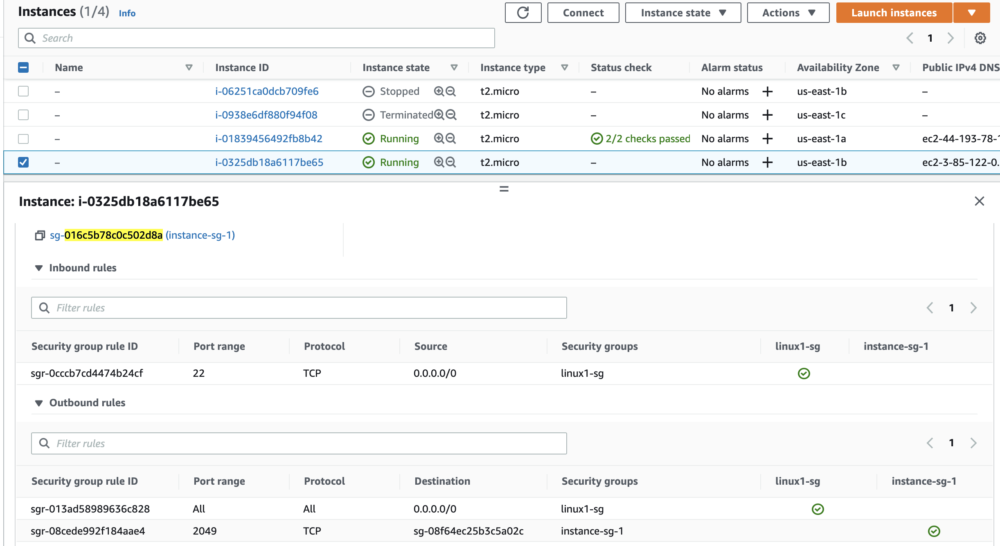
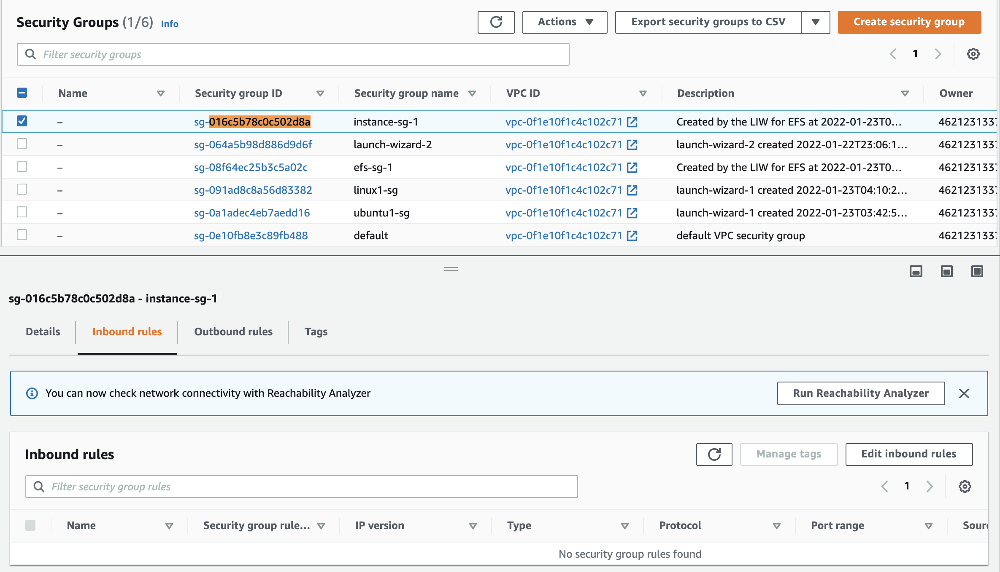
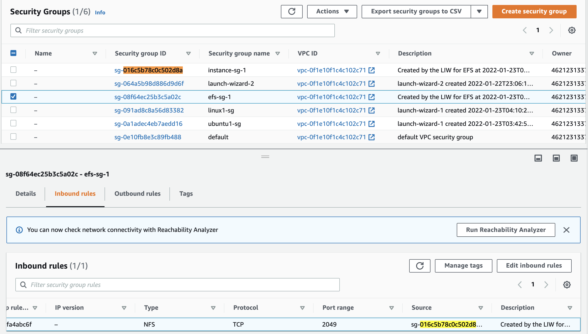

# aws-efs-connect-ec2-demo 🐳


[](https://github.com/tquangdo/aws-efs-connect-ec2-demo/issues/new)

## reference
1. [linuxhint](https://linuxhint.com/mount-efs-ec2-instances/)
2. [aws](https://docs.aws.amazon.com/efs/latest/ug/troubleshooting-efs-mounting.html)

## EFS
- create `DTQEFSDemo` with:
- 1. AZ=`us-east-1a` & `us-east-1b`
- 2. SG=`default` (NOT in this screenshot)


## EC2
### A) Ubuntu
#### AWS
- launch 1 instance with SG=`ubuntu1-sg` & AZ=`us-east-1a`
- add 1 inbound rule:
- 1. NFS (port: 2049)
- 2. IP=`Anywhere IPv4` (0.0.0.0/0)
- ⚠️⚠️WARNING!!!⚠️⚠️: EFS: change SG from `default` to `ubuntu1-sg`
#### SSH
- SSH to ubuntu:
```shell
~$ sudo apt update -y # 1st
sudo apt install git binutils -y
git clone https://github.com/aws/efs-utils
./efs-utils/build-deb.sh
sudo apt update -y # 2nd
sudo apt install ./build/amazon-efs-utils*deb -y
mkdir ~/efs-mount
ubuntu@ubuntu:~$ sudo mount -t efs -o tls fs-0cf6164f211e8bdd7:/ efs-mount
df -T | grep nfs4
->
127.0.0.1:/    nfs4     9007199254739968       0 9007199254739968    0% ~/efs-mount
~$ sudo touch efs-mount/DTQUbuntu.txt
sudo umount efs-mount
df -T | grep nfs4
-> NOT see!!!
~$ ls efs-mount
-> 0!!!
```
### B) Linux
#### AWS
- launch 1 instance with SG=`linux1-sg` & AZ=`us-east-1b`
- add EFS with path `/efs-mount` (different from `~/efs-mount`)

> sau khi launch EC2 thi KO the edit them EFS lai duoc!!!
- will auto create 2 SG `instance-sg-1` & `efs-sg-1`
- SG's relation:
- 1. EC2 `linux` has 2 SG: `linux1-sg` & `instance-sg-1`

- 2. `instance-sg-1` has NO inbound rule

- 3. EFS `DTQEFSDemo` will auto added SG `efs-sg-1`

- 4. `efs-sg-1` has inbound rule with source=`instance-sg-1`

> muon xoa `instance-sg-1` & `efs-sg-1` thi phai delete Inbound Rule phu thuoc lan nhau!!!
#### SSH
```shell
~$ df -T | grep nfs4
->
127.0.0.1:/    nfs4     9007199254739968       0 9007199254739968    0% /efs-mount
ls /efs-mount
-> `DTQUbuntu.txt`
```
### C) change file/folder between Ubuntu & Linux
#### Linux
```shell
~$ sudo touch /efs-mount/DTQLinux.txt
```
#### Ubuntu
- will auto reflect to Ubuntu
```shell
~$ ls efs-mount
-> `DTQUbuntu.txt` & `DTQLinux.txt`
```
---
### D) mount in Linux
```shell
~$ sudo mkdir /efs-mount-2
sudo mount -t efs -o tls fs-0cf6164f211e8bdd7:/ /efs-mount-2 # Linux default auto installed efs cli
df -T | grep nfs4
->
127.0.0.1:/    nfs4     9007199254739968       0 9007199254739968    0% /efs-mount
127.0.0.1:/    nfs4     9007199254739968       0 9007199254739968    0% /efs-mount-2
```

## note
### connect EFS by `NFS client` besides `EFS mount helper`
```shell
sudo apt-get install nfs-common # (for Ubuntu)
sudo mount -t nfs4 -o nfsvers=4.1,rsize=1048576,wsize=1048576,hard,timeo=600,retrans=2,noresvport fs-07ab2b2fd07cc4ead.efs.us-west-2.amazonaws.com:/ /mnt/efstest
```